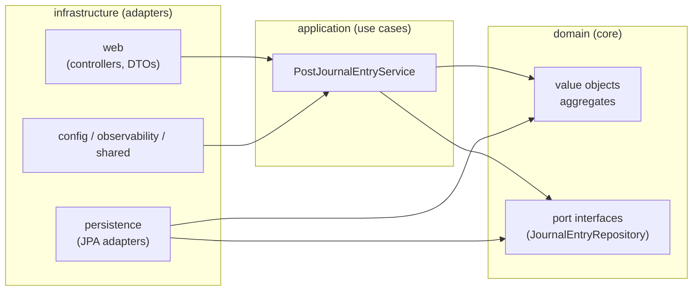

# Hexagonal architecture

This guide is a developer's tour of the codebase. It covers the three-layer structure, what lives where, how a request flows from HTTP to the database and back, and what ArchUnit will reject if you try to cross the boundaries. The "why" for each decision is in the ADRs linked throughout.

---

## Three-layer overview

Keystone uses hexagonal architecture (ports and adapters). The single rule: dependencies point inward. Infrastructure imports from application and domain. Application imports from domain only. Domain imports from nothing in this codebase.



**Import direction vs. abstraction direction.** It is tempting to read `persistence → ports` as "infrastructure controls the domain." It does not. `JournalEntryRepository` is a Java `interface` declared inside `domain`. Infrastructure's `JpaJournalEntryRepository` has `implements JournalEntryRepository` in its class declaration, which requires an import of the domain interface — not the other way around. The domain owns the abstraction; infrastructure provides the implementation. See [ADR-0002](../adr/0002-hexagonal-architecture.md) for the full explanation.

---

## Tour of each layer

### `domain/`

Pure POJOs. No Spring, no JPA, no Jackson, no SLF4J — ArchUnit enforces this at build time. The domain can be exercised with plain JUnit, no running container, no database.

Sub-packages:

| Sub-package | Contents |
|---|---|
| `domain.shared` | `Result<T, E>` — the success-or-failure type used at all internal API boundaries |
| `domain.money` | `Money` (long minor-units + `Currency`) and `MoneyError` (overflow) |
| `domain.account` | `AccountCode` — typed string wrapper for a ledger account code |
| `domain.journal` | `JournalEntry`, `JournalEntryId`, `PersistedJournalEntry`, `Posting`, `Side`, `JournalError`, and the `JournalEntryRepository` port interface |

The `domain.journal` package contains both the aggregate (`JournalEntry`) and the persistence port (`JournalEntryRepository`). Keeping the port in domain is intentional: the domain owns the contract; infrastructure fulfills it.

### `application/`

Use-case services. One class today: [`PostJournalEntryService`](../../src/main/java/co/embracejoy/accounting/keystone/application/journal/PostJournalEntryService.java). Services call domain factories and port methods; they do not touch Spring or JPA.

**Why no `@Service` annotation?** Annotating a class with `@Service` imports `org.springframework.stereotype.Service`, which would violate the ArchUnit rule `APPLICATION_DOES_NOT_IMPORT_SPRING`. Instead, [`ApplicationConfig`](../../src/main/java/co/embracejoy/accounting/keystone/infrastructure/config/ApplicationConfig.java) wires the service as a Spring `@Bean`:

```java
// infrastructure/config/ApplicationConfig.java, line 13
@Bean
public PostJournalEntryService postJournalEntryService(JournalEntryRepository repository) {
    return new PostJournalEntryService(repository);
}
```

Spring injects the `JpaJournalEntryRepository` adapter (which bears `@Repository`) at startup. The service only sees `JournalEntryRepository` — the domain interface.

### `infrastructure/`

All Spring, JPA, Micrometer, and Jackson code lives here. Sub-packages:

| Sub-package | Contents |
|---|---|
| `infrastructure.persistence.journal` | `JpaJournalEntryRepository` (port adapter), `JournalEntryEntity`, `PostingEntity`, `JournalEntryEntityMapper`, `JournalEntryJpaRepository` (Spring Data `JpaRepository`) |
| `infrastructure.web` | `JournalEntryController`, `ResultMapper`, `ValidationExceptionHandler`, `CorrelationIdFilter`, and `dto/` (request + response records) |
| `infrastructure.observability` | `MetricsConfig` — custom Prometheus counters and timers wired via Micrometer |
| `infrastructure.shared` | `UuidV7Generator` — mints RFC 9562 UUID v7 identifiers |
| `infrastructure.config` | `ApplicationConfig` — wires application-layer services as Spring beans |

`KeystoneApplication.java` sits in the root `keystone` package (one level above `infrastructure`), which is required for Spring's component scan to cover all sub-packages.

---

## Worked example: tracing POST /journal-entries end to end

The full path a request takes through the layers, with file and line references.

### Step 1 — Controller receives the HTTP request

[`JournalEntryController.post`](../../src/main/java/co/embracejoy/accounting/keystone/infrastructure/web/JournalEntryController.java#L49) is the entry point:

```java
// JournalEntryController.java, lines 49-51
@PostMapping
public ResponseEntity<?> post(@Valid @RequestBody PostJournalEntryRequest request) {
    return postDuration.record(() -> handle(request));
}
```

`@Valid` triggers Bean Validation on the DTO before the method body runs. The timer wraps the call for Prometheus latency tracking.

### Step 2 — Controller maps DTO to domain types

[`handle`](../../src/main/java/co/embracejoy/accounting/keystone/infrastructure/web/JournalEntryController.java#L53) converts the raw JSON fields into domain value objects:

```java
// JournalEntryController.java, lines 54-59
Currency currency = Currency.getInstance(request.currency());
List<Posting> postings =
    request.postings().stream().map(p -> toDomainPosting(p, currency)).toList();

Result<PersistedJournalEntry, JournalError> result =
    service.post(request.occurredOn(), request.description(), postings);
```

[`toDomainPosting`](../../src/main/java/co/embracejoy/accounting/keystone/infrastructure/web/JournalEntryController.java#L75) wraps each raw field:

```java
// JournalEntryController.java, lines 75-78
private static Posting toDomainPosting(PostingRequest p, Currency currency) {
    return new Posting(
        new AccountCode(p.account()), Side.valueOf(p.side()), new Money(p.minorUnits(), currency));
}
```

No business logic here — the controller's job is translation, not decisions.

### Step 3 — Application service orchestrates the use case

[`PostJournalEntryService.post`](../../src/main/java/co/embracejoy/accounting/keystone/application/journal/PostJournalEntryService.java#L22) is a single expression:

```java
// PostJournalEntryService.java, lines 22-24
public Result<PersistedJournalEntry, JournalError> post(
    LocalDate occurredOn, String description, List<Posting> postings) {
  return JournalEntry.of(occurredOn, description, postings).map(repository::save);
}
```

It delegates construction to the domain factory, then — only on success — calls the port to persist.

### Step 4 — Domain factory enforces the invariants

[`JournalEntry.of`](../../src/main/java/co/embracejoy/accounting/keystone/domain/journal/JournalEntry.java#L31) is the sole construction path for a `JournalEntry`:

```java
// JournalEntry.java, lines 31-61
public static Result<JournalEntry, JournalError> of(
    LocalDate occurredOn, String description, List<Posting> postings) {
  // ...
  if (postings.isEmpty()) {
    return Result.failure(new JournalError.NoPostings());
  }
  // single-currency check
  // balanced debits == credits check
  return Result.success(new JournalEntry(occurredOn, description, currency, postings));
}
```

If any invariant is violated, a `Result.Failure<JournalError>` propagates back to the controller without an exception.

### Step 5 — Port is called; adapter handles persistence

`repository::save` resolves at runtime to [`JpaJournalEntryRepository.save`](../../src/main/java/co/embracejoy/accounting/keystone/infrastructure/persistence/journal/JpaJournalEntryRepository.java#L24):

```java
// JpaJournalEntryRepository.java, lines 24-28
@Override
public PersistedJournalEntry save(JournalEntry entry) {
    var entity = JournalEntryEntityMapper.toEntity(entry, UuidV7Generator.create());
    var saved = jpa.save(entity);
    return JournalEntryEntityMapper.toDomain(saved);
}
```

[`UuidV7Generator.create()`](../../src/main/java/co/embracejoy/accounting/keystone/infrastructure/shared/UuidV7Generator.java#L28) mints a time-ordered UUID v7 at save time. `jpa.save` delegates to Spring Data JPA, which writes to the Flyway-managed Postgres schema. The mapper then converts the `JournalEntryEntity` back into a `PersistedJournalEntry` — the domain wrapper that combines the new `JournalEntryId` with the original `JournalEntry`.

### Step 6 — Result folds back to HTTP

In [`handle`](../../src/main/java/co/embracejoy/accounting/keystone/infrastructure/web/JournalEntryController.java#L61), `result.fold` dispatches on success or failure:

```java
// JournalEntryController.java, lines 61-73
return result.fold(
    persisted -> {
        postedOk.increment();
        return ResponseEntity.created(URI.create("/journal-entries/" + persisted.id().value()))
            .body(JournalEntryResponse.of(persisted));
    },
    error -> {
        postedInvalid.increment();
        return ResponseEntity.badRequest()
            .contentType(MediaType.parseMediaType("application/problem+json"))
            .body(ResultMapper.toProblemDetail(error));
    });
```

On success the controller returns `201 Created` with a `JournalEntryResponse` JSON body and a `Location` header. On failure it returns `400 Bad Request` with an RFC 9457 `ProblemDetail` body.

---

## Where to put new code

| Question | Answer |
|---|---|
| Adding a new domain rule (validation, invariant)? | `domain/` — unit test with plain JUnit, no Spring context |
| Adding a new use case (orchestrate domain calls)? | `application/` — new service class; unit test fakes the ports with an in-test implementation |
| Need to persist something new? | `domain/` for the port interface; `infrastructure/persistence/` for the JPA adapter; mirror the package layout (e.g. `infrastructure/persistence/journal/` for journal-related adapters) |
| New REST endpoint? | `infrastructure/web/` — controller + DTO records; MockMvc integration test |
| Need a Spring `@Configuration`? | `infrastructure/config/` only |
| Cross-cutting infrastructure utility (ID generation, correlation IDs)? | `infrastructure/shared/` |

---

## The Result pattern at the boundary

Internal APIs that can fail in expected ways return `Result<T, E>` rather than throwing. `Result` is a [`sealed interface`](../../src/main/java/co/embracejoy/accounting/keystone/domain/shared/Result.java#L15) with two permitted implementations: `Success` and `Failure`.

```java
// Result.java, lines 15-30
public sealed interface Result<T, E> permits Result.Success, Result.Failure {
  static <T, E> Result<T, E> success(T value) { return new Success<>(value); }
  static <T, E> Result<T, E> failure(E error) { return new Failure<>(error); }

  <U> Result<U, E> map(Function<? super T, ? extends U> mapper);
  <U> Result<U, E> flatMap(Function<? super T, Result<U, E>> mapper);
  <R> R fold(Function<? super T, ? extends R> onSuccess,
             Function<? super E, ? extends R> onFailure);
}
```

The error type `E` is always a sealed interface (e.g. `JournalError`), which gives the compiler exhaustive pattern-match checking.

At the HTTP boundary, [`ResultMapper.toProblemDetail`](../../src/main/java/co/embracejoy/accounting/keystone/infrastructure/web/ResultMapper.java#L19) folds each `JournalError` variant into an RFC 9457 `ProblemDetail`:

```java
// ResultMapper.java, lines 19-26
public static ProblemDetail toProblemDetail(JournalError error) {
    return switch (error) {
        case JournalError.NoPostings ignored -> noPostings();
        case JournalError.MixedCurrencies mc -> mixedCurrencies(mc);
        case JournalError.Unbalanced u -> unbalanced(u);
        case JournalError.Overflow o -> overflow(o);
    };
}
```

The sealed switch must be exhaustive; adding a new `JournalError` variant breaks the build at `ResultMapper` until you handle it. This is intentional — the compiler enforces coverage.

**Real bugs still throw.** `RuntimeException` (NPE, illegal state, IO failure) propagates as normal. The ArchUnit rule `NO_PUBLIC_METHOD_RETURNS_THROWABLE` forbids any public method whose declared return type is `Throwable` or a subtype, so the discipline is structural, not just convention.

See [ADR-0004](../adr/0004-result-type-and-problem-details.md) for the full reasoning.

---

## Ports and adapters: adding a new adapter

The journal entry repository is the canonical example. Here is how to add a second one, step by step.

**1. Define the port in `domain/`.**

Create `domain/journal/XxxRepository.java` as a plain Java interface. No Spring annotations, no JPA imports.

```java
package co.embracejoy.accounting.keystone.domain.journal;

public interface XxxRepository {
    Xxx save(Xxx value);
    Optional<Xxx> findById(XxxId id);
}
```

**2. Write a fake implementation for unit tests.**

An in-test class in the same test file (or a shared test helper) implements the port with an in-memory `HashMap`. The service's unit test uses this fake; no Spring context needed.

```java
class FakeXxxRepository implements XxxRepository {
    private final Map<XxxId, Xxx> store = new HashMap<>();

    @Override public Xxx save(Xxx value) { store.put(value.id(), value); return value; }
    @Override public Optional<Xxx> findById(XxxId id) { return Optional.ofNullable(store.get(id)); }
}
```

**3. Write the real adapter in `infrastructure/persistence/`.**

```java
@Repository
@Transactional
public class JpaXxxRepository implements XxxRepository {
    private final XxxJpaRepository jpa;
    // ... map JPA entities to/from domain types
}
```

`@Repository` makes Spring's component scan pick it up and inject it wherever `XxxRepository` is declared in a constructor.

**4. Wire it (if needed).**

If the adapter has `@Repository`, Spring auto-discovers it. If you need explicit wiring (e.g. to choose between two implementations), add a `@Bean` method in `infrastructure/config/ApplicationConfig.java`.

**5. Test at two levels.**

- Service unit test: inject `FakeXxxRepository` directly. Fast, no database.
- Adapter integration test: use Testcontainers to spin up real Postgres. Verify the SQL round-trip.

---

## Common pitfalls — what ArchUnit forbids and why

These rules live in [`HexagonalArchitectureTest`](../../src/test/java/co/embracejoy/accounting/keystone/architecture/HexagonalArchitectureTest.java) and run on every `./mvnw verify`.

| Rule name | What it forbids | Why |
|---|---|---|
| `DOMAIN_DOES_NOT_IMPORT_SPRING` | Any `domain..` class importing `org.springframework..` | Spring annotations (`@Component`, `@Autowired`, etc.) couple business rules to the Spring lifecycle. Domain tests would require a Spring context. |
| `DOMAIN_DOES_NOT_IMPORT_JPA` | Any `domain..` class importing `jakarta.persistence..` | JPA annotations (`@Entity`, `@Column`) couple the aggregate model to the persistence mechanism. Swapping JPA would require touching domain code. |
| `DOMAIN_DOES_NOT_IMPORT_JACKSON` | Any `domain..` class importing `com.fasterxml.jackson..` | Jackson annotations couple value objects to JSON serialization. |
| `DOMAIN_DOES_NOT_IMPORT_SLF4J` | Any `domain..` class importing `org.slf4j..` | Logging is an infrastructure concern. Domain logic should not carry a logging dependency. |
| `APPLICATION_DOES_NOT_IMPORT_SPRING` | Any `application..` class importing `org.springframework..` | Keeps service classes domain-pure. Spring wiring happens in `infrastructure/config/`. |
| `WEB_DOES_NOT_DEPEND_ON_PERSISTENCE_ENTITIES` | Any `infrastructure.web..` class importing `infrastructure.persistence..` | Controllers must communicate with the domain through domain types (`JournalEntry`, `PersistedJournalEntry`), not JPA entities (`JournalEntryEntity`). The mapper in `persistence` handles entity ↔ domain translation; the web layer never sees JPA entities directly. |
| `NO_PUBLIC_METHOD_RETURNS_THROWABLE` | Any public method whose declared return type is `Throwable` or a subtype | Enforces the Result discipline: expected failures return `Result`, not exceptions. This rule is scoped to production classes only (`DoNotIncludeTests`) because JUnit's `assertThrows` legitimately returns `Throwable`. |
| `CLASSES_ARE_IN_EXPECTED_TOP_LEVEL_PACKAGES` | Any class outside `domain..`, `application..`, or `infrastructure..` (except the root package) | Prevents accidental package drift and keeps the three-layer contract visible in the directory structure. |
| `CONTROLLERS_LIVE_IN_WEB_PACKAGE` | `@RestController` classes outside `infrastructure.web..` | Controllers belong to the web adapter; placing them elsewhere breaks the sub-package layout and makes them harder to find. |

If a rule fires, the build prints the violating class and the rule name. Fix by moving the class or removing the offending import.

---

## Related ADRs

| ADR | One-line context |
|---|---|
| [ADR-0002 — Hexagonal architecture](../adr/0002-hexagonal-architecture.md) | Why ports-and-adapters; the full import-vs-abstraction explanation |
| [ADR-0003 — Money as integer minor units](../adr/0003-money-as-integer-minor-units.md) | Why `Money` stores a `long`, never `double` or `BigDecimal` |
| [ADR-0004 — Result type and ProblemDetails](../adr/0004-result-type-and-problem-details.md) | Why internal APIs return `Result<T, E>`; how failures become RFC 9457 responses |
| [ADR-0007 — JUnit Jupiter 6](../adr/0007-junit-jupiter-6.md) | Test framework and conventions (`@DisplayName`, `assertThrows`, etc.) |
| [ADR-0010 — JournalEntryId wrapper and UUID v7](../adr/0010-journal-entry-id-wrapper.md) | Why `PersistedJournalEntry` exists; why the adapter generates the ID, not the domain |
